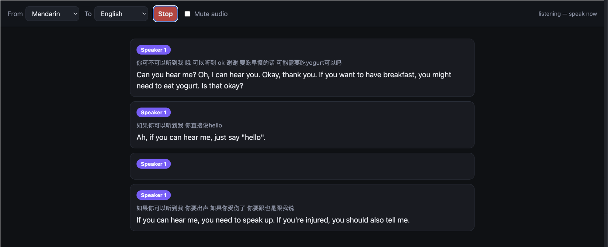

# Live Translate + Diarize POC

Real-time speech translation with speaker diarization, powered by Alibaba's
Qwen3.8 LiveTranslate model over DashScope's realtime WebSocket API.

The browser captures mic audio and shows results; a thin FastAPI backend
relays audio to DashScope and holds the API key. Each utterance is tagged with
a speaker id and shown as its own card, source text above the translation.



## Run

```bash
cp .env.example .env        # fill in DASHSCOPE_API_KEY
uv run server.py            # http://localhost:8000
```

Self-check the event parser without a key:

```bash
uv run server.py --self-check
```

## How it works

- `server.py` — FastAPI app. Serves `static/index.html`, bridges the browser
  `/ws` socket to DashScope, and normalizes DashScope events into flat messages
  (`normalize_event`).
- `static/index.html` — mic capture, language selection, speaker cards.
- Diarization needs the 3.8 model (`qwen3.8-livetranslate-flash-realtime`);
  speaker ids ride on `speech_started` events with `speaker_detection` turn
  detection.

## Config

Non-secret per-model defaults live in `models.json`. Credentials and optional
deployment overrides live in `.env`; environment variables take precedence.

## Golden-pair audio and evals

Run the complete evaluation pipeline with one command:

```bash
uv run evals/eval.py run-pipeline
```

Use `--language ms --limit 2` for a small batch. A pipeline run builds the
manifest, synthesizes missing audio, runs Qwen and Gemini in both translation
directions, and judges the results with Router Claude Opus. It prints one run
id and writes matching `evals/results_<run-id>.csv` and
`evals/judged_results_<run-id>.csv` checkpoints.

The required configuration is:

- `OPENAI_API_KEY` and `ffmpeg` for audio synthesis;
- `DASHSCOPE_API_KEY` for Qwen;
- `GEMINI_API_KEY`, or `GOOGLE_CLOUD_PROJECT` with application credentials,
  for Gemini;
- `ROUTER_BASE_URL` and `ROUTER_API_KEY` for judging.

Synthesis defaults to `gpt-4o-mini-tts`, the `cedar` voice, speed `1.0`, and a
calm clinical delivery. See the stage-specific `--help` output for overrides.

English WAVs are shared by `item_id` (for example `MED-001_en.wav`); translated
WAVs use the row's `pair_id` and `language_code` (for example
`en-ms_MED-001_ms.wav`). Final files are 16 kHz, mono, 16-bit PCM for the live
model evaluator. The generated voices are AI-generated, not human recordings.

Each stage can also run independently:

```bash
uv run evals/eval.py build-manifest
uv run evals/eval.py synthesize-audio
uv run evals/eval.py run-translations --output evals/results.csv
uv run evals/eval.py judge-results evals/results.csv
```

Judging uses `bedrock.claude-opus-5` through `ROUTER_BASE_URL` and
`ROUTER_API_KEY`, with three concurrent workers. It preserves the 19
translation-result columns and appends `winner` (`qwen`, `gemini`, or `draw`),
`grading_reason`, and `grading_error` in `judged_<input filename>`.

### Checkpoints, failures, and resume

Translation and judging atomically rewrite their CSV checkpoint after every API
response, so completed cells survive interruption and the CSV is never left
half-written. On the first observed error, the stage prints the error, stops
launching new requests, checkpoints responses already in flight, and exits
non-zero. `run-pipeline` stops automatically and prints an exact resume command.

Runs are fresh by default. Give inference a stable output path if you may want
to resume it later:

```bash
uv run evals/eval.py run-translations --output evals/results.csv
uv run evals/eval.py run-translations --resume --output evals/results.csv

uv run evals/eval.py judge-results evals/results.csv
uv run evals/eval.py judge-results evals/results.csv --resume
```

Repeat the original `--language` and `--limit` filters when resuming a stage.
The checkpoint is rejected if its rows, columns, or source data do not match,
which prevents accidentally combining different runs. Synthesis checkpoints as
atomic WAV files: retrying skips valid completed files, while `--overwrite`
starts that selected synthesis batch fresh.

Resume a complete pipeline by supplying the run id printed by the failed run:

```bash
uv run evals/eval.py run-pipeline --run-id 20260925_120000 --resume \
  --language ms --limit 2
```

Fresh translation and judgment commands refuse to replace an existing output;
use `--resume` to keep completed work or `--overwrite` to start that stage over.
Use `--overwrite-audio` on `run-pipeline` to regenerate otherwise valid WAVs.

Run the offline checks without credentials or network access:

```bash
uv run evals/eval.py self-check
```
